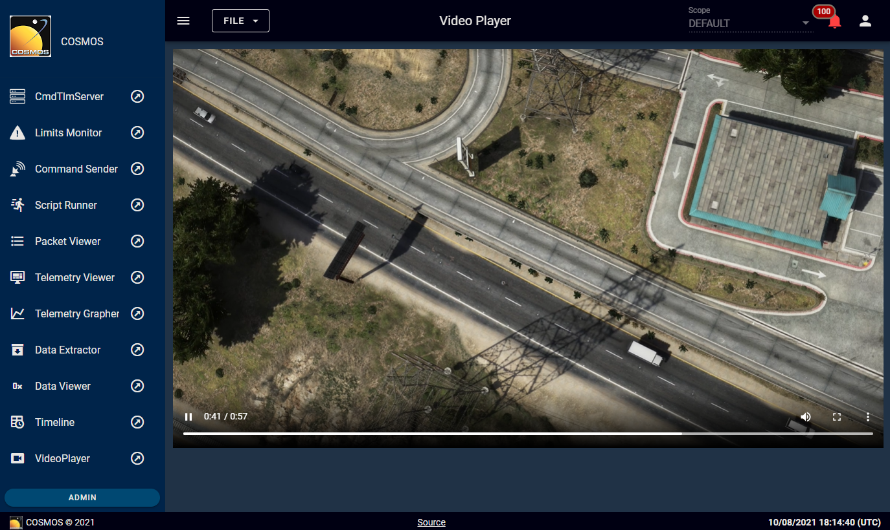

# cosmosc2-tool-videoplayer

Check out [this gist](https://gist.github.com/ryan-pratt/d364a65677874d04a674c46b171113aa) to see how this fits into an end-to-end video streaming demo in COSMOS 5.

This plugin provides COSMOS 5 with an integrated video player capable of playing back most common video file types, as well as HLS streams. Included is the top-level tool and a widget that can be used in TlmViewer screens.

[Documentation](http://cosmosc2.com)



## Installation

[Yarn](https://classic.yarnpkg.com/lang/en/docs/install) and [rake](https://rubygems.org/gems/rake) must be installed to build this plugin. To build the plugin, clone this repository and run the following commands:

```
> yarn
> yarn build
> rake build VERSION=5.0.0
```

*Note: If you only want the tool, you can run `yarn build-tool` instead of `yarn build`.*

The `rake` command will create a .gem file which can be uploaded to COSMOS via the plugins tab in the admin console to install the plugin.

## Usage

### VideoPlayer tool

The tool has a "File" menu with four options. If you have a static video you would like to play, you can use the "Upload Video" option. This will upload the file to the "userdata" bucket in COSMOS's instance of Minio and create a tool configuration to load that file. VideoPlayer will loop playback of these files.

*Note: The "userdata" bucket is protected, and by default cannot be accessed publicly without logging in. The tool uses presigned requests generated by the COSMOS API to upload and access files.*

If you would like to play a video or HLS stream that is already hosted elsewhere on the internet, you can add that to VideoPlayer with the "New Source" menu option. This will switch the source to the given URL, but won't create a tool configuration. Make sure to "Save Configuration" if you want to easily retreive this video later, with the "Open Configuration" menu option.

### Videoplayer widget

The included widget for TlmGrapher is fairly rudimentary. It is just a playback window, so you must create configurations elsewhere, such as in the VideoPlayer tool itself. Once this plugin is installed, the widget can be added to a TlmGrapher screen with the keyword `VIDEOPLAYER` and the name of the configuration for it to load as its one parameter. For example:

1. Navigate to VideoPlayer and select File > Upload Video
1. Choose and upload a file called "test.mp4"
1. Navigate to TlmGrapher and open the screen you want to add the video to
1. Edit the screen and append the line `VIDEOPLAYER test.mp4` to the screen definition
